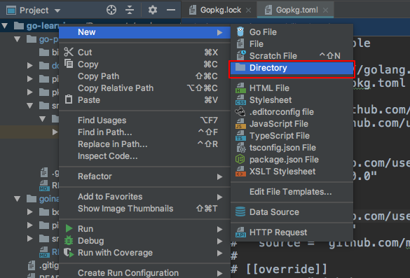

# GoLand和Dep管理工具最佳实践

```
@author 鲁伟林
作为一个从Java转过来的我，刚开始接触Go项目的项目管理工具，超级想念Java中的maven。
抱着既来之则安之的态度，记录下这篇博客。如有说错的地方，或更好的解决方案，请留言。
博客题目叫：GoLand和Dep管理工具最佳实践。鄙人敲打“最佳”两个字时，心中忐忑不安，但搜索并思考很久，觉得博客中方案个人认为的确不错。希望有更好实践，请留言告知。

本博客中涉及的完整代码：
GitHub地址: https://github.com/thinkingfioa/go-learning
本人博客地址: https://blog.csdn.net/thinking_fioa
文中如若有任何错误，欢迎指出。个人邮箱: thinking_fioa@163.com
```

## GOROOT和GOPATH环境变量解释
GOROOT和GOPATH都是GO语言需要的环境变量。可以通过命令**go env**来查看环境变量，输出如下:

```
GOARCH="amd64"
GOBIN=""
GOCACHE="/Users/thinking/Library/Caches/go-build"
GOEXE=""
GOHOSTARCH="amd64"
GOHOSTOS="darwin"
GOOS="darwin"
GOPATH="/Users/thinking/go"
GORACE=""
GOROOT="/usr/local/Cellar/go/1.10.2/libexec"
GOTMPDIR=""
GOTOOLDIR="/usr/local/Cellar/go/1.10.2/libexec/pkg/tool/darwin_amd64"
GCCGO="gccgo"
CC="clang"
CXX="clang++"
CGO_ENABLED="1"
CGO_CFLAGS="-g -O2"
CGO_CPPFLAGS=""
CGO_CXXFLAGS="-g -O2"
CGO_FFLAGS="-g -O2"
CGO_LDFLAGS="-g -O2"
PKG_CONFIG="pkg-config"
GOGCCFLAGS="-fPIC -m64 -pthread -fno-caret-diagnostics -Qunused-arguments -fmessage-length=0 -fdebug-prefix-map=/var/folders/qz/7v0twcvd1bqd6878v_pm_v040000gn/T/go-build056907507=/tmp/go-build -gno-record-gcc-switches -fno-common"
```

## 1. GOROOT 
golang的安装目录，Go语言提供的底层库通过GOROOT环境变量查找

## 2. GOPATH 
可以理解为Go语言的工作目录。鄙人使用GoLand编辑器，我一般喜欢通过GoLand配置，只配置Project GOPATH。可以将Project GOPATH配置成当前目录。


## Dep 工具使用
dep目前仍然没有Java中maven好用，勉强可用于Go语言的依赖管理工具。dep与godep不是一个东西，dep是官方版本.

### 1. 查看版本
dep version ----- 查看dep工具版本和build日期等.

### 2. 初始化
使用命令: dep init初始化，需要在指定目录下: $GOPATH/src/${ProjectName}下调用。将会生成两个文件和一个目录，分别是：Gopkg.lock、Gopkg.toml和vendor，如下图。在GoLand下只配置Project GOPATH，再使用dep管理工具，可以根据项目将依赖包分开，避免多个项目之间冲突。


#### 2.1 Gopkg.lock 解释
自动生成文件，不允许手动修改。

#### 2.2 Gopkg.toml 解释
Go语言依赖管理的核心文件，可以手动修改。一般情况下Gopkg.toml里面只定义直接依赖项，而Gopkg.lock里面除了包含Gopkg.toml中的所有项之外，还包含传递依赖项。

#### 2.3 目录vendor
依赖管理目录，这个目录的依赖代码优先加载。

### 3. 依赖管理

#### 3.1 添加一条依赖 
dep ensure -add github.com/muesli/cache2go。该指令会更新Gopkg.toml和Gopkg.lock并安装到依赖项至vendor/下。

#### 3.2 添加一条依赖并指定某个tag
dep ensure -add github.com/muesli/cache2go@=0.1

#### 3.3 添加后，确保同步
dep ensure -v ----- 参数-v可以帮助查看执行过程，建议加上

#### 3.4 删除没有用到的 package
dep prune -v

#### 3.5 依赖更新
dep ensure -update -v

### 3.6 查看依赖状态
dep status ----- 列出应用程序中使用的版本和开发人员发布的最新版本

### 3.7 删除依赖
修改Gopkg.toml文件内容，保证代码中没有被引用，然后执行dep ensure

## 创建一个GoLand项目

### 第一步 创建工程项目名
新建一个Directory，作为工程项目名字


### 第二步 创建目录结构
建立Go语言工程项目通用的目录结构: bin、pkg和src。


### 第三步 创建子项目名称
在src目录下，建立你的项目名称，如上图中的concurrentcache项目名

### 第四步 配置Project GOPATH
使用GoLand软件，我通常只配置Project GOPATH，再使用dep管理工具，这样每个工程项目都有自己的依赖包，避免多个工程项目之间冲突。


### 第四步
通过GoLand的Terminal控制台，进入到src/${ProjectName}下，调用dep init，生成项目依赖文件Gopkg.lock、Gopkg.toml和vendor目录。则大功告成。

## 参考

 1. [go之官方依赖管理工具dep安装和使用](https://blog.csdn.net/guyan0319/article/details/81588316)