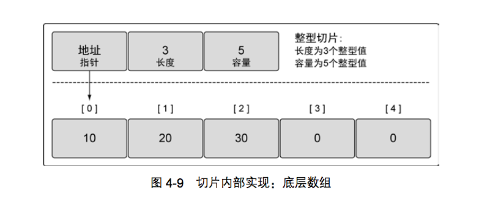
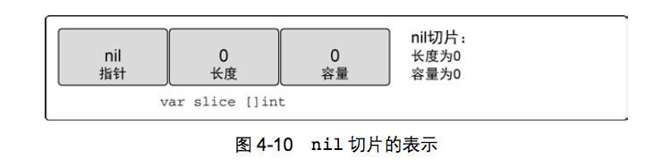
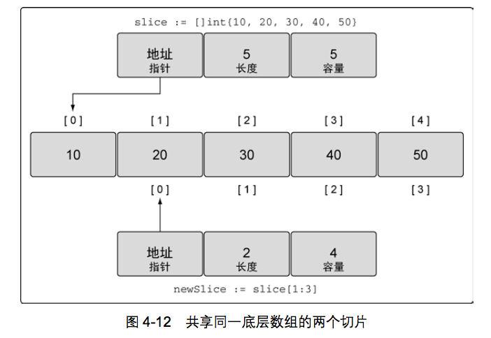
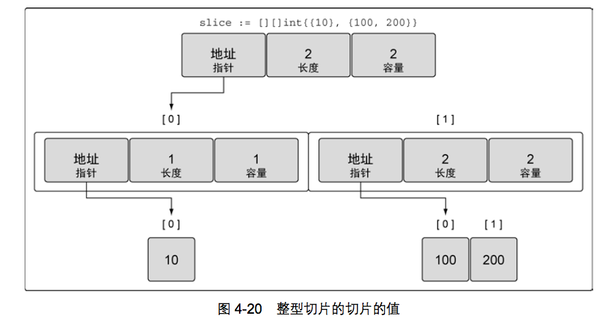
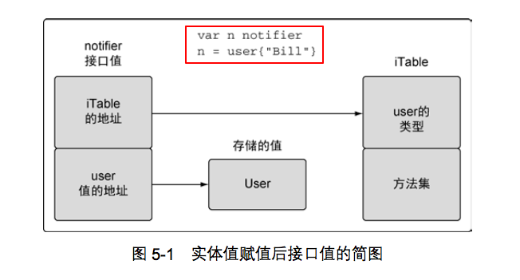
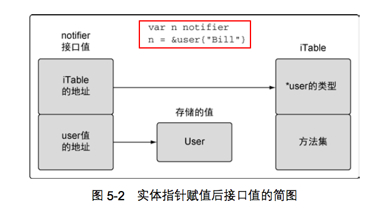
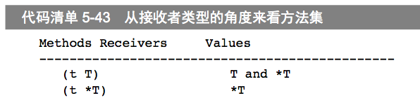
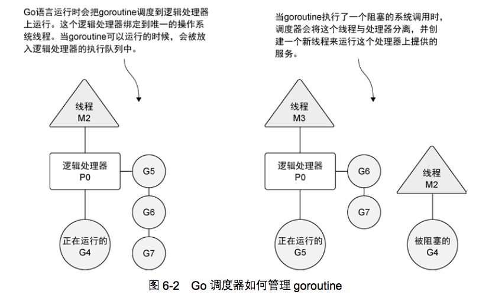

# Go-In-Action
```
@author 鲁伟林
记录《Go语言实战》中各章节学习过程，写下一些自己的思考和总结。希望维护管理此仓库，记录学习过程中部分心得，以与其他同行参考。

本博客中涉及的完整代码：
GitHub地址: https://github.com/thinkingfioa/go-learning
本人博客地址: https://blog.csdn.net/thinking_fioa
文中如若有任何错误，欢迎指出。个人邮箱: thinking_fioa@163.com
```

## 第1章 Go语言开始

### 1.1 Go语言介绍
Go语言的出现，实则为并发而出现的语言也不过为。Java语言中利用多线程机制可以较为方便的实现程序并发，提高程序并发度。Go语言并发较于Java更加细化，在线程基础，利用goroutine再并发一次，粒度更小。

学习Go语言最重要的是学会写并发，也就是写goroutine和通道(channel)

### 1.2 Go语言环境配置
鄙人写Go语言是使用GoLand工具。推荐使用。GoLand安装和Go语言环境安装自行Google或百度即可。

### 1.3 官方源码地址
项目中源码基本原型来自于《Go语言实战》书本中。书本源码情参考[地址](https://github.com/goinaction/code)

## 第2章 快速开始一个Go程序

### 2.1 项目总结 

### 2.2 技术总结

## 第3章 打包和工具链

### 3.1 包
1. 同一个目录下的.go文件必须声明同一个包名
2. main包 ---- 命名为main的包具有特殊意义：使用声明main的包的代码所在的目录名作为二进制可执行文件的文件名

### 3.2 导入
1. import导入包顺序 ---- 编译器首先查找Go的安装目录(GOROOT)，然后才会按照顺序超招GOPATH变量里列出的目录
2. 命名导入 ---- 在import语句给出包路径的左侧定义一个名字，将导入的包命名为新的名字（用于解决重名的包）。如果只是导入而不想使用，使用下划线字符(_)（空白标识符）

### 3.3 函数init
init函数在程序执行开始的时候被调用。所有被编译器发现的init函数都会安排在main函数之前执行

### 3.4 使用Go的工具
1. go build ---- 编译
2. go clean ---- 清理
3. go run ---- 执行

### 3.5 进一步介绍Go开发工具

##### 3.5.1 Go代码格式化
go fmt用户格式化Go语言代码。GoLand工具可以在Go文件保存之前自动格式化，配置方式: Tools -> File Watchers -> go fmt

##### 3.5.2 Go语言依赖管理工具
TODO:::: dep依赖管理工具学习

## 第4章 数组、切片和映射
Go语言有3种数据结构来管理集合：数组、切片和映射

### 4.1 数组的内部实现和基础功能
数组是一组长度固定的数据类型，用于存储一段具有相同类型的元素的连续块。数组的每个元素类型都是相同，又是连续分配，可通过索引快速查找到对应的数据。

- 数组创建完成后，存储的数据类型和数组长度就不再允许改变。

#### 4.1.2 声明和初始化
##### 4.1.2.1 var声明
使用var变量声明类型时，总是会用对应类型的零值对变量进行初始化。

```
// 数组array中每个元素都初始化为0
var array [5]int
```

##### 4.1.2.2 数组字面量
1. 直接创建并初始化数组
2. 可以使用...来替代数组长度
3. 声明数组并指定特定索引位置的值

```
array := [5]int {1,2,3,4,5}
// 使用...来替代数组长度
array := [...]int {1,2,3,4,5}
// 声明数组并指定特定元素的值。只有下标为1的值为10，下标为4的值为40
array := [5]int {1:10 ,4: 40}
```

#### 4.1.3 使用数组
使用[]运算符来访问数组里的某个单独元素

```
array := [5]int {10, 20, 30, 40, 50}
array[2]=35
```

##### 4.1.3.1 指针数组
声明一个指针数组，使用*运算符访问元素

```
array := [5]*int{0: new(int), 1: new(int)}
*array[0]=10
*array[1]=20
```

##### 4.1.3.2 数组赋值操作
1. 数组长度和元素类型一样，可直接赋值操作。赋值后两个数组之间拥有各自的底层数据，修改相互不影响
2. 复制指针数组，只会复制指针的地址，而不会复制指针所指向的值。赋值后两个数组指针共享底层数据，修改相互影响

```
package main

import "fmt"

func main() {
	var array1 [3]*string

	array2 := [3]*string{new(string), new(string), new(string)}
	*array2[0] = "Red"
	*array2[1] = "Blue"
	*array2[2] = "Green"

	array1 = array2

	*array1[0] = "Yellow"
	// 遍历
	for index := range array1 {
		fmt.Println(*array1[index])
	}

	// 遍历
	for index := range array2 {
		fmt.Println(*array1[index])
	}
}
```

#### 4.1.4 多维数组
多维数组的特性与一维数组特性完全一致。包括初始化、遍历，赋值等特性

```
array := [4][2]int{{10,11},{20,21},{30,31},{40,41}}
```

#### 4.1.5 在函数间传递数组
Go语言函数之间传递变量，总是以值的方式传递。如果这个变量是数组，不管都长，都会完整复制一份。所以数组作为函数参数传递，将严重影响程序的内存和性能。

推荐的方式是传入指向数组的指针，但是要提醒的是：如果传递的是指针，改变指针指向的值，会改变共享的内存，对原数组有影响，请慎重处理。

### 4.2 切片的内部实现和基础功能
切片是围绕着动态数组，切片的底层内存也是在连续块中分配。但其与数组在内部实现和基础功能存在较多不同点。类似于Netty的ByteBuf中的slice(切片)概念。

切片与数组最大的不同点是：切片为共享而生。基于一个切片创建新的切片，新的切片会和原有的切片共享底层数组。

#### 4.2.1 内部实现
切片由3个字段组成，分别是：执行底层数组的指针、切片访问的元素的个数（即长度）和切片允许增长到的元素个数（即容量）。如下图


#### 4.2.2 创建和初始化
Go语言中有几种方法可以创建和初始化切片

##### 4.2.2.1 make函数
内置的make函数创建切片，需要传入一个参数，制定切片的长度。也可以同时指定长度和容量。

```
// 创建字符串切片，其长度和容量都是5个元素
slice := make([]string, 5)
// 创建一个整型切片，其长度为3，容量为5
slice := make([]string, 3, 5)
```

##### 4.2.2.2 切片字面量
另一种常见的创建切片的方法是使用切片字面量

```
// 创建字符串切片
slice := []string {"Red", "Blue", "Yellow"}
// 创建长度和容量都为100的整型切片
slice := []int {100: 1000}
```

##### 提醒
使用切面量创建数组和切片非常相似。如果[]运算符里指定了一个值，那么创建的就是数组而不是切片

```
// 创建3个元素的整型数组
array := [3]int {1,2,3}
// 创建长度和容量都是3的切片
array := []int{1,2,3}
```

##### 4.2.2.3 nil和空切片
创建nil的切片 ----- val slice []int


创建空切片

```
// 使用make创建空的整型切片
slice := make([]int, 0)
// 使用make创建空的整型切片
slice := []int {}
```

#### 4.2.3 使用切片

##### 4.2.3.1 赋值和切片
对切片里某个索引执行的元素赋值和对数组里的某个索引指向的元素赋值的方法完全一样

```
slice := []int {1,2,3}
slice[2] = 4
```

基于一个切片创建出新的切片，新的切片和原来的切片共享一个底层数组，如下代码和图

```
// 如上图所示
slice := []int {10, 20, 30, 40, 50}
// 创建一个新的切片
newSlice := slice[1:3]
```


计算:

1. 如何计算新切片的长度和容量. slice[i:j] ----- 长度=j-i, 容量=k-i，其中k是原切片容量
2. slice[i:j:k] ----- 长度=j-i, 容量=k-i。推荐使用该方式

##### 4.2.3.2 切片增长 ----- append函数
相对于数组，使用切片的一个好处是：可按需增加切片的容量。Go语言里使用append函数来实现，append函数可同时追加多个值

函数append总是会增加新切片的长度，当容量不够时，append函数会创建一个新的底层数组，将原有的值复制进去，再追加新的值。与其他语言的可变长度数组扩容逻辑基本类似。所以一次性分配足够的容量，可有效减少扩容时间。

```
package main

import "fmt"

func main() {
	slice := []int{10, 20, 30, 40, 50}

	newSlice := slice[2:5:5]

	newSlice = append(newSlice, 60)
	fmt.Println("Slice :")
	for index, value := range slice {
		fmt.Println("Index %d, Value: %d", index, value)
	}
	fmt.Println("NewSlice :")
	for index, value := range newSlice {
		fmt.Println("Index %d, Value: %d", index, value)
	}
}
```

##### 4.2.3.3 创建切片时的3个索引
推荐创建切片时，使用三个值。如：slice[i:j:k]。第三个值k是用来控制新切片的容量，其目的是限制容量，防止误操作改变了原切片的底层数据。

slice[i:j:k] ----- 长度=j-i, 容量=k-i。k(容量)和j(长度)设置成一样，可防止底层误操作。当新切片容量不够时，append函数会自动进行扩容，与原切片底层分离，而不会修改原切片的值。

append函数可同时追加多个值，如果使用...运算符，可将一个切片的所有元素追加到另一个切片里。eg: newSlice = append(slice1, slice2...)

##### 4.2.3.4 迭代切片

关键字range迭代。关键字range会返回两个值，第一个是索引的位置（可用下划线忽略索引值），第二个是该位置对应元素值的一份副本。

```
for index, value := range slice {
	fmt.Println("index %d, value: %d", index, value)
}
```

传统的for循环方式迭代

```
for index:0; index < len(slice); index++ {
	fmt.Println("index %d, value %d", index, slice[index]);
}
```

注：对于切片，函数len返回切片的长度，函数cap返回切片的容量

#### 4.2.4 多维切片
切片是一维的，也可以创建多维切片。eg: slice := [][]int {{10}, {100, 200}}

append函数同样适用于多维切片。eg: slice[0] = append(slice[0], 2)



#### 4.2.5 在函数间传递切片
函数间传递切片，只是切片自身值(切片的3个字段)被复制一份，不会涉及底层数组。在函数间传递切片代价非常小。

### 4.3 映射的内部实现和基础功能
映射是一种数据结构，用于存储一系列无序的键值对。映射是一种无序的集合，意味着没有办法预测键值对被返回的顺序

#### 4.3.2 创建和初始化
映射的创建和初始化与数组、切片的方式一样，第一种：使用内置的make函数，第二种：使用映射字面量

映射的键可以是任何值。但是切片、函数以及包含切片的结构类型都具有引用语义，不能作为映射的键

##### 4.3.2.1 make函数
如下代码生声明一个键的类型是string，值的类型是int

```
// 声明一个键的类型是string，值的类型是int
dict := make(map[string]int)
```

##### 4.3.2.2 使用映射字面量

```
// 声明一个键的类型是string，值的类型是string
dict := map[string]string {"red": "1", "blue": "2", "yellow": "3"}
```

#### 4.3.3 使用映射
映射取值有两种选择。

第一种选择是，可以同时获得值，以及一个表示这个键是否存在的标志

```
// 第一种方法
ageValue, exist := dict["age"]
if exist {
	fmt.Println("age is  %s", ageValue)
}
```

第二种选择是，只返回对应的值，然后再通过判断这个值是不是对应类型的零值来确定键是否存在

```
// 第二中方法
phoneValue := dict["phone"]
if "" != phoneValue {
	fmt.Println("phone is %d", phoneValue)
}
```

#### 删除映射中的键
如果想把一个键值对从映射中删除，可使用内置的delete函数, eg: delete(dict, "age")

#### 遍历映射
遍历映射，使用range关键字。关键字range返回的不是索引和值，而是键值对

```
// 遍历
for key, value := range dict {
	fmt.Println("key is %s, value is %s", key, value)
}
```

#### 4.3.4 在函数间传递映射
在函数之间传递映射，并不会制造出该映射的一个副本。实际上传递映射给一个函数时，在函数中如果对该映射做了修改，所有对这个映射的引用都会觉察到这个修改。该特性与切片类似，保证使用最小的成本来复制映射

## 第5章 Go语言的类型系统
Go语言是静态编译的语言。Go语言提供基本类型，同时也允许用户自定义类型

### 5.1 用户定义类型
Go语言里声明用户定义的类型有两种方法，第一种：使用关键字struct（最常用），第二种：基于一个已有的类型，将其作为新类型

#### 5.1.1 使用关键字struct定义类型
使用关键字struct定义类型。如下代码：

```
type user struct {
	name  string
	email string
}
```

##### 5.1.1.1 使用关键字var声明
使用var声明变量时，这个变量对应的值总是会被初始化。如: var wllu user。对于数值类型来说，零值是0； 对于字符串来说，零值是空串；对于布尔类型，零值是false

##### 5.1.1.2 结构字面量
使用结构字面量和短变量声明操作符来创建变量。其中（:=）称之为短变量声明操作符。

##### 声明每个字段的名字以及对应的值
声明每个字段的名字以及对应的值

```
u := user {
	name: "thinking",
	email: "thinking_fioa@163.com",
}
```

##### 没有字段名，只声明对应的值

```
// 没有字段名，只声明对应的值
u := user{"thinking", "thinking_fioa@163.com"}
```

#### 5.1.2 基于已有的类型，将其作为新类型的类型
使用关键字type，类型于重命名，但编译器不会对不同的类型的值做隐式转换。该方式提高了可读性。eg: type Duration int64

### 5.2 方法
方法能给用户定义的类型添加新的行为。方法实际上也是函数，只是在声明时，在关键字func和方法名之间添加一个参数。

关键字func和函数名之间的参数被称为**接收者**。Go语言里有两种类型的接收者：值接收者和指针接收者

Go语言既允许使用值，也允许使用指针来调用方法，不必严格符合接收者的类型。Go语言编译器会自动帮助转换，以符合方法声明的接收者。

#### 5.2.1 值接收者

```
func (u user) notify() {}
```
值接收者调用时会使用这个值的一个副本来执行，意味着你对这个值的副本做了任何修改，原来调用者不受影响

#### 5.2.2 指针接受者

```
func (u *user) notify() {}
```
指针接收者使用实际的值来执行，意味着方法中对值的做了任何修改，原来的值将同步变化

#### 总结
值接收者使用值的副本来调用方法，而指针接收者使用实际值来调用方法

### 5.3 类型的本质
为一个类型添加方法时，需要考虑该类型的方法是值接收者还是指针接受者。如果是要创建一个新值，就使用值接收者。如果是要修改当前值，就使用指针接收者。

#### 5.3.1 内置类型
数值类型、字符串类型和布尔类型都是内置类型。内置类型都是以副本在方法或函数间传递，对这些值进行增加或者删除的时候，会创建一个新值。

#### 5.3.2 引用类型
Go语言中的引用类型有如下几个：切片、映射、通道、接口和函数类型。通过复制来传递一个引用类型的值的副本，本质上是在共享底层数据结构。

#### 5.3.3 结构类型
原始本质的类型和非原始本质类型。原始本质类型指的是应该被复制，而不应该被共享的类型。非原始本质类型指的是应该被共享，不应该被复制。

是使用值接收者还是指针接收者，不应该由该方法是否修改了接收到的值来决定。这个决策应该基于该类型的本质。这个规则由一个例外，需要让类型值符合某个接口时，即便类型的本质是非原始的，也可以使用值接收者声明方法。

### 5.4 接口
接口的出现是为了实现多态。多态是指代码可以根据类型的值的具体实现采取不同行为的能力。

#### 5.4.2 实现
接口是用来定义行为的类型。如果用户定义的类型实现了某个接口类型声明的一组方法，那么这个用户定义的类型的值就可以赋给这个接口类型的值。用于定义的类型的值通常称为实体类型。

接口值分为两种，第一个：实体值赋值给接口值，第二个：实体指针赋值给接口值。接口值是一个两个字长度的数据结构，第一个字包含一个指向内部表(iTable)的指针，包含了所存储的值的类型信息。第二个字是一个指向所存储值的指针






#### 5.4.3 方法集
方法集定义了一组关联到给定类型的值或者指针的方法。定义方法时使用的接收者的类型决定了这个方法关联到值，还是关联到指针，还是两个都关联。请与5.2章节区分，这里Go语言编译器不会自动帮助转换。

从接收者的角度看这些规则：


如果使用值接收者来实现一个接口，那么那个类型的值和指针都能赋值给对应的接口。如果使用指针接收者实现一个接口，那么只能指向那个类型的指针才能赋值给对应的接口。如有不懂，可参考listing36.go和listing36P.go帮助理解

### 5.5 嵌入类型
Go语言允许用户扩展或修改已有类型的行为，这对于代码复用很有好处。这个功能是通过嵌入类型实现的。**嵌入类型是将已有的类型直接声明在新的结构类型里**。

通过嵌入类型，与内部类型相关的标识符会提升到外部类型上。这些被提升的标识符就像直接声明在外部类型里的标识符一样，也是外部类型的一部分。这样外部类型就组合了内部类型包含的所有属性，并且可以添加新的字段和方法。外部类型可通过声明与内部类型标识符同名的标识符来覆盖内部标识符的字段或方法。

```
type notifier interface {
	notify()
}

type user struct {
	name  string
	email string
}

func (u user) notify() {
	fmt.Printf("name %s, email %s\n", u.name, u.email)
}

type admin struct {
	user
	password string
}

func main() {

	ad := admin{
		user: user{
			name:  "thinking_fioa",
			email: "thinking_fioa@163.com",
		},
		password: "123456",
	}
	// 可以直接访问内部类型的方法
	ad.user.notify()
	// 内部类型的方法也被提升到外部类型中
	ad.notify()
}
```
注：

1. 要嵌入一个类型，只需要声明这个类型的名字就可以了
2. 通过嵌入类型，与内部类型相关的标识符(包括属性和方法)会提升到外部类型上
3. 通过内部类型的名字可以访问内部类型的值
4. 由于内部类型相关的标识符被提升到外部类型上，也可以直接通过外部类型访问
5. 内部类型的提升，内部类型实现的接口会自动提升到外部类型。外部类型(admin)也实现了接口(notifier)

外部类型可通过声明与内部类型标识符同名的标识符来覆盖内部标识符的字段或方法。亦可实现对应的接口

```
type notifier interface {
	notify()
}

type user struct {
	name  string
	email string
}

func (u user) notify() {
	fmt.Printf("name is %s, email is %s\n", u.name, u.email)
}

type admin struct {
	user
	password string
}

func (ad admin) notify() {
	fmt.Printf("name is %s, email is %s, passwd is %s\n", ad.name, ad.email, ad.password)
}

func main() {
	ad := admin{
		user: user{
			name:  "thinking",
			email: "thinking_fioa@163.com",
		},
		password: "123456",
	}

	sendNotification(ad.user)
	sendNotification(ad)
}

func sendNotification(n notifier) {
	n.notify()
}
```
注：

1. 由于内部类型的提升，内部类型实现的接口会自动提升到外部类型。这就意味着由于内部类型的实现，外部类型也同样实现了这个接口
2. 如果外部类型覆盖内部标识符的方法，则内部类型的实现将不会被提升。不过内部类型的值一直存在，可通过内部类型的值来调用内部实现的方法。

### 5.6 公开或未公开的标识符
Go语言支持从包里公开或者隐藏标识符。当一个标识符的名字以小写字母开头时，表示这个标识符未公开，即包外的代码不可见。如果一个标识符以大写字母开头，表示该标识符是公开的，包外的代码可见。通常将代码所在的文件夹名作为包名

```
package counters
type alertCounter int


func New(value int) alertCounter {
	return alertCounter(value)
}
```
```
import (
	"./counters"
	"fmt"
)

func main() {
	counter := counters.New(1)
	fmt.Printf("count %d", counter)
}
```
注：

1. 将工厂函数命名为New是Go语言的一个习惯
2. New函数返回了一个未公开的alertCount类型的值。原因有两个，第一，标识符才有公开或者未公开，值永远没有。第二，短变量声明操作符，有能力捕获引用的类型，并创建一个未公开的的类型变量。

```
package entities

type user struct {
	Name  string
	Email string
}

type Admin struct {
	user
	Passwd string
}
```
```
import (
	"./entities"
	"fmt"
)

func main() {

	ad := entities.Admin{
		Passwd: "123456",
	}
	ad.Name = "thinking"
	ad.Email = "thinking_fiao@163.com"

	fmt.Printf("name %s, email %s, passwd %s", ad.Name, ad.Email, ad.Passwd)
}
``` 
注：

1. 内部类型user未公开，无法直接通过结构字面量的方式初始化内部类型
2. 内部类型的标识符全部被提升至外部类型，所以这些公开的字段(Name、Email)可通过外部类型的值直接来访问

## 第6章 并发
Go语言里的并发指的是能让某个函数独立于其他函数运行的能力。当一个函数创建为goroutine时，Go会将其视为独立的工作单元。

Go语言的并发同步模型来自一个叫作通信顺序进程(CSP)。CSP是一种消息传递模型，在goroutine之间传递数据来传递消息，而不是对数据进行加锁来实现同步。

### 6.1 并发和并行
操作系统会在物理处理器上调度线程来执行，而Go语言的运行会在逻辑处理器上调度goroutine来运行。在1.5版本后，Go语言的运行默认会在每个可用的物理处理器分配一个逻辑处理器。

如果创建一个goroutine并准备运行，这个goroutine会被放到调度器的全局运行队列中。之后，调度器就将队列中的goroutine分配一个逻辑处理器，并放到这个逻辑处理器对应的本地运行队列中，如下图6-2


1. 如果正在运行的goroutine需要执行一个阻塞的系统调用，当前逻辑处理器绑定的线程和goroutine会从逻辑处理器分离，调度器会创建一个新的线程，并将其绑定到逻辑处理器上，如上图线程M3。一旦被阻塞的系统调用执行完并返回，对应的goroutine会放回本地运行队列中
2. 如果一个goroutine需要做一个网络I/O调用，流程上有些不同。该goroutine会和逻辑处理器分离，并移到集成了网络轮询器的运行。

### 6.2 goroutine
下面是一段代码，有两个goroutine匿名函数，同时逻辑处理器的数量设置为2（runtime.GOMAXPROCS(2))

```
func main() {
	runtime.GOMAXPROCS(2)

	var wg sync.WaitGroup
	wg.Add(2)

	fmt.Println("start program")
	go func() {
		defer wg.Done()
		for count := 0; count < 3; count++ {
			for char := 'a'; char < 'a'+26; char++ {
				fmt.Printf("%c ", char)
			}
		}
	}()

	go func() {
		defer wg.Done()

		for count := 0; count < 3; count++ {
			for char := 'A'; char < 'A'+26; char++ {
				fmt.Printf("%c ", char)
			}
		}
	}()

	wg.Wait()
	fmt.Println("Finisg")
}
```

1. runtime.GOMAXPROCS(2) ----- 设置逻辑处理器数目为2
2. 大写字母和小写字母间隔输出，且每次运行结果都不相同

### 6.3 竞争状态
竞争状态：两个或多个gorotine在没有相互同步的情况下，访问某个共享的资源，并试图同时读和写这个资源。int类型是非线程安全，在多gorotine访问时需要保护操作。下面代码就存在竞争状态

```
var (
	count int
	wg    sync.WaitGroup
)

func main() {
	wg.Add(2)
	go addCount()
	go addCount()

	wg.Wait()
	fmt.Printf("count %d", count)

}

func addCount() {
	defer wg.Done()
	for i := 0; i < 10000; i++ {
		if i == 500 {
			// 当前的gorotine从线程退出，并放回本地运行队列
			runtime.Gosched()
		}
		count++
	}
}
```

1. 代码输出与预期不符
2. runtime.Gosched() ----- 将从当前线程退出，给其他gorotine运行机会
3. count的类型是int，非线程安全
4. go build -race ----- 检查代码中的竞争状态(上面例子未检查出来，我也很奇怪？)

### 6.4 锁住共享资源
Go语言提供了传统的同步gorotine的机制，就是对共享资源加锁，类似于其他语言。atomic和sync包里的函数提供了很好的解决方案

#### 6.4.1 原子函数
##### 使用 atomic包中的AddInt64函数

```
var (
	count int64
	wg    sync.WaitGroup
)

func main() {
	wg.Add(2)

	go addCount(10000)
	go addCount(10000)

	wg.Wait()

	fmt.Printf("count %d", count)
}

func addCount(loopNum int) {
	defer wg.Done()

	for i := 0; i < loopNum; i++ {
		//count++
		atomic.AddInt64(&count, 1)
	}
}
```
注：
使用原子方法:atomic.AddInt64(&count, 1)，来保证线程安全

##### 使用原子函数LoadInt64和StoreInt64
原子函数LoadInt64和StoreInt64提供了一种安全地读和写一个整型值的方式

```
var (
	shutdown int64
	wg       sync.WaitGroup
)

func main() {
	wg.Add(2)

	go doWork("A")
	go doWork("B")

	time.Sleep(10 * time.Second)
	atomic.StoreInt64(&shutdown, 1)
	wg.Wait()
	fmt.Println("Finish")
}

func doWork(name string) {
	defer wg.Done()

	for {
		fmt.Printf("output %s\n", name)
		time.Sleep(250 * time.Millisecond)

		if atomic.LoadInt64(&shutdown) == 1 {
			fmt.Printf("%s shutdown.\n", name)
			break
		}
	}
}
```

1. 原子函数LoadInt64和StoreInt64保证了变量shutdown同步和可见性
2. time.Sleep(1 * time.Second) ----- gorotine暂停1秒

#### 6.4.2 互斥锁(mutex)
另一种同步访问共享资源的方式是使用互斥锁(mutex)。互斥锁用于在代码上创建一个临界区，保证同一时间只有一个goroutine可以执行这个临界区代码。使用mutex.Lock()和mutex.Unlock()声明一段代码是临界区

```
var (
	count int64
	wg    sync.WaitGroup
	mutex sync.Mutex
)

func main() {

	wg.Add(2)

	go addCount(10000)
	go addCount(10000)

	wg.Wait()
	fmt.Printf("count %d\n", count)
}

func addCount(loopNum int) {
	defer wg.Done()

	for i := 0; i < loopNum; i++ {
		mutex.Lock()
		count++
		mutex.Unlock()
	}
}
```

### 6.5 通道
Go语言不仅提供了**原子函数和互斥锁**来保证对共享资源的安全访问以及消除竞争状态，还可以使用**通道**，通过发送和接收需要共享的资源

Go语言使用内置函数make来创建一个通道。通道有两种类型，一个是无缓冲的通道，一个是有缓冲的通道

1. unbuffered := make(chan int) ----- 无缓冲通道，第一个参数是关键字chan，之后跟着允许通道交换的数据类型
2. buffered := make(chan string, 10) ----- 有缓冲通道，第一个参数是关键字chan，之后跟着允许通道交换的数据类型，第二参数是缓冲大小
3. buffered <- "thinking" ----- 通过通道发送一个字符串
4. value := <- buffered ----- 从通道接收一个字符串

#### 6.5.1 无缓冲的通道
无缓冲的通道是指在接收前没有能力保存任何值的通道。通道要求发送gorotine和接收gorotine同时准备好，才能完成发送和接收操作，否则将一直阻塞等待。

无缓冲的通道操作是一个阻塞操作，数据没有被成功接收，发送gorotine将一直阻塞。

```
var wg sync.WaitGroup

func init() {
	rand.Seed(time.Now().UnixNano())
}

func main() {
	court := make(chan int)

	wg.Add(2)

	go player("thinking", court)
	go player("ppp", court)

	court <- 1

	wg.Wait()
}

func player(name string, court chan int) {

	defer wg.Done()
	for {

		ball, ok := <-court
		if !ok {
			fmt.Printf("Player %s Won\n", name)
			return
		}

		n := rand.Intn(100)
		if n%13 == 0 {
			fmt.Printf("Player %s Missed\n", name)
			close(court)
			return
		}

		fmt.Printf("Player %s Hit %d\n", name, ball)
		ball++

		court <- ball
	}
}
```

#### 6.5.2 有缓冲的通道
有缓冲的通道是一种在被接收前能存储一个或多个值的通道。只有在通道中没有要接收的值时，接收动作才会阻塞。只有在通道没有可用缓冲区容纳被发送的值时，发送动作才会阻塞。有点类似于Java语言中的LinkedBlockingQueue

```
const (
	numberWorker = 4
	taskNum      = 10
)

var wg sync.WaitGroup

func init() {
	rand.Seed(time.Now().Unix())
}

func main() {
	wg.Add(numberWorker)

	tasks := make(chan string, taskNum)

	// 启动${numberWorker}个goroutine
	for gr := 1; gr <= numberWorker; gr++ {
		go worker(tasks, gr)
	}
	// 提交任务
	for post := 1; post <= taskNum; post++ {
		tasks <- fmt.Sprintf("Task : %d", post)
	}
	// 关闭通道
	close(tasks)
	wg.Wait()
}

func worker(tasks chan string, work int) {
	defer wg.Done()

	for {
		// 获取任务
		task, ok := <-tasks
		if !ok {
			fmt.Printf("Worker: %d : Shutting Down\n", work)
			return
		}

		fmt.Printf("Worker: %d : Started %s\n", work, task)

		sleep := rand.Int63n(100)
		time.Sleep(time.Duration(sleep) * time.Millisecond)

		fmt.Printf("Worker: %d : Completed %s\n", work, task)
	}
}
```

1. close(tasks) ----- 关闭通道。当通道关闭时，goroutine依旧可以从通道接收数据，但是不能再向通道里发送数据。从一个已经关闭且没有数据的通道里获取数据，总会立刻返回，并返回一个通道类型的零值
2. const (......) ----- 常量的定义

## 第7章 并发模式
主要介绍3个可以在实际工程中使用的包: runner、pool和work

### 7.1 runner
runner包用于展示如何使用通道来监视程序的执行时间，如果程序运行时间太长，也可以使用runner包来终止程序

runner支持以下终止点:

1. 程序可以在分配的时间内完成工作，正常终止
2. 程序没有及时完成工作，终止程序执行
3. 接收到操作系统发送的中断事件，程序立即清理状态并停止工作

run.go 代码如下

```
type Runner struct {
	// 接收操作系统发送的中断信号
	interrupt chan os.Signal

	complete chan error

	// 接收超时事件
	timeout <-chan time.Time

	// 执行的函数，必须是一个接收整数且什么都不返回的函数
	tasks []func(int)
}

var ErrTimeout = errors.New("received timeout")
var ErrInterrupt = errors.New("received interrupt")

func New(d time.Duration) *Runner {
	return &Runner{
		// interrupt通道的缓冲区容量初始化为1，确保语言运行是发送这个事件的时候不会阻塞
		interrupt: make(chan os.Signal, 1),
		// 当任务完成或退出后，返回一个error或者nil值，将等待main函数区接收这个值
		complete: make(chan error),
		// 在指定duration时间后，向通道发送一个time.Time的值
		timeout: time.After(d),
	}
}

func (r *Runner) add(tasks ...func(int)) {
	r.tasks = append(r.tasks, tasks...)
}

func (r *Runner) Start() error {
	//
	signal.Notify(r.interrupt, os.Interrupt)

	go func() {
		r.complete <- r.run()
	}()

	select {
	case err := <-r.complete:
		return err
	case <-r.timeout:
		return ErrTimeout
	}
}

func (r *Runner) run() error {
	for id, task := range r.tasks {
		if r.gotInterrupt() {
			return ErrInterrupt
		}

		task(id)
	}
	return nil
}

func (r *Runner) gotInterrupt() bool {
	select {
	case <-r.interrupt:
		// 当发生中断事件信号时，停止接收后续信号
		signal.Stop(r.interrupt)
		return true
	default:
		return false
	}
}
```

main.go

```
const timeout = 3 * time.Second

func main() {
	log.Printf("Starting work.")

	r := runner.New(timeout)

	r.Add(createTask(), createTask(), createTask())

	if err := r.Start(); err != nil {
		switch err {
		case runner.ErrTimeout:
			log.Println("Terminating due to timeout.")
			os.Exit(1)
		case runner.ErrInterrupt:
			log.Println("Terminating due to interrupt.")
			os.Exit(2)
		}
	}
}

func createTask() func(int) {
	return func(id int) {
		log.Printf("Processor - Task #%d.", id)
		time.Sleep(time.Duration(id) * time.Second)
	}
}
```

#### 7.1.1 代码解释

1. New(...)函数 ----- Go语言中工厂函数通常称为New函数，函数接收一个time.Duration类型的值，并返回Runner类型的指针。
2. compete被初始化为无缓冲的通道。设计成无缓冲的通道是因为向这个通道发送一个error类型的值或者nil值，之后就会等待main函数接收这个值。
3. select语句的经典用法。goInterrupt(...)函数展示了select语句的经典用法。select语句在没有任何要接收的数据时会阻塞，但是如果有default分支就不会阻塞了。如：Start函数中的select语句就会阻塞，直到接收到值

### 7.2 pool
pool包展示如何使用有缓冲的通道实现资源池，来管理可以在任意数量的goroutine之间共享及独立使用的资源。

当资源池资源不够时，创建新的资源分配，如下factory字段是一个函数类型，可以用该函数创建新的资源

pool.go代码如下：

```
type Pool struct {
	m sync.Mutex

	//有缓冲的通道资源池
	resources chan io.Closer
	factory   func() (io.Closer, error)
	closed    bool
}

var ErrPoolClosed = errors.New("Pool has been closed.")

func New(fn func() (io.Closer, error), size uint) (*Pool, error) {
	if size <= 0 {
		return nil, errors.New("size value is wrong")
	}

	return &Pool{
		resources: make(chan io.Closer, size),
		factory:   fn,
	}, nil
}

func (p *Pool) Acquire() (io.Closer, error) {
	select {
	case r, ok := <-p.resources:
		log.Printf("Acquire:", "New Resource")
		if !ok {
			return nil, ErrPoolClosed
		}
		return r, nil
	default:
		return p.factory()
	}
}

func (p *Pool) Release(r io.Closer) {
	p.m.Lock()
	defer p.m.Unlock()

	if p.closed {
		r.Close()
		return
	}

	select {
	case p.resources <- r:
		log.Printf("Release:", "In Queue")
	default:
		log.Println("Release:", "Closing")
		r.Close()
	}
}

func (p *Pool) Close() {
	p.m.Lock()
	defer p.m.Unlock()

	if p.closed {
		return
	}

	p.closed = true

	// 在清空通道里的资源之前，将通道关闭，如果不这样做，会发生死锁
	close(p.resources)

	for r := range p.resources {
		r.Close()
	}

}
```

main.go代码

```
const (
	maxGoroutines   = 25
	pooledResources = 2
)

type dbConnection struct {
	ID int32
}

func (dbConn *dbConnection) Close() error {
	log.Println("Close: Connection", dbConn.ID)
	return nil
}

var idCounter int32

func createConnection() (io.Closer, error) {
	id := atomic.AddInt32(&idCounter, 1)
	log.Println("Create: New Connection", id)

	return &dbConnection{id}, nil
}

func main() {
	var wg sync.WaitGroup
	wg.Add(maxGoroutines)

	p, err := pool.New(createConnection, pooledResources)
	if err != nil {
		log.Println(err)
	}

	for query := 0; query < maxGoroutines; query++ {
		go func(q int) {
			performQueries(q, p)
			wg.Done()
		}(query)
	}

	wg.Wait()

	log.Println("Shutdown Program.")
	p.Close()
}

func performQueries(query int, p *pool.Pool) {
	conn, err := p.Acquire()
	if err != nil {
		log.Println(err)
		return
	}

	defer p.Release(conn)

	time.Sleep(time.Duration(rand.Intn(1000)) * time.Millisecond)
	log.Printf("Query: QID[%d] CID[%d]\n", query, conn.(*dbConnection).ID)
}
```

#### 7.2.1 代码解释

1. Release(...)方法和Close(...)方法必须要代码同步。防止资源已经关闭，仍发送数据。
2. Acquire(...)方法 ----- 还有可用资源时会从资源池里返回一个资源，否则调用factory字段的函数类型创建一个新的资源。

### 7.3 work
work包的目的是展示如何使用无缓冲的通道来创建一个goroutine池，多个goroutine执行并控制一组工作，让其并发执行。

使用无缓冲的通道要比随意指定一个缓冲区大小的有缓冲的通道好，因为这个情况下既不需要一个工作队列，也不需要一组goroutine配合执行。

work.go代码如下：

```
type Worker interface {
	Task()
}

type Pool struct {
	work chan Worker
	wg   sync.WaitGroup
}

func New(maxGoroutine int) *Pool {
	p := Pool{
		work: make(chan Worker),
	}

	p.wg.Add(maxGoroutine)

	for i := 0; i < maxGoroutine; i++ {
		go func() {
			for w := range p.work {
				w.Task()
			}
			// goroutine结束
			p.wg.Done()
		}()
	}

	return &p
}

func (p *Pool) Run(w Worker) {
	p.work <- w
}

func (p *Pool) Shutdown() {
	close(p.work)
	// 等待所有的goroutine终止
	p.wg.Wait()
}
```

#### 7.3.1 代码解释

1. Work.go中New(...)函数 ----- 使用固定数量的goroutine来创建一个工作池
2. wg sync.WaitGroup参数用来控制Shutdown()函数，保证所有的goroutine截止，才函数退出


